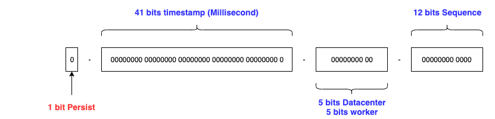

# snowflake

Twitter snowflake worker - Twitter雪花ID计算器

[twitter announcing](https://blog.twitter.com/engineering/en_us/a/2010/announcing-snowflake.html)


## Introduction

The default Twitter format shown below.



* Default: 1-41-10(5-5)-12, time accurecy is millsecond
* [Baidu-Generator](https://github.com/baidu/uid-generator): 1-28-22-13, time accurecy is second
* nodeBits = DatacenterBits + workerBits

### Usage

import github.com/github/snowflake

```go


// You can set your epoch time
// but do not set the time before 69 years ago, then you should get the overflowed number
snowflake.SetDefEpochTime(1577808000000) // default epoch time is 2020-01-01 00:00:00.000

snowflake.SetMaxNode(10, 12) // default nodeBits = 10, sequenceBits = 12

worker, _ := snowflake.NewWorker(0)  // below pow(2, nodeBits) = 1024

// get by for
id := worker.Next()

// get by sleep Millisecond
id = worker.NextSleep()
```

### Benchmark

```go
go test -bench=. -benchmem  -run=none


goos: darwin
goarch: amd64
pkg: github.com/go-trellis/snowflake
BenchmarkNext-8                   	 4924492	       244 ns/op	       0 B/op	       0 allocs/op
BenchmarkNextMaxSequence-8        	 8908449	       136 ns/op	       0 B/op	       0 allocs/op
BenchmarkNextNoSequence-8         	    1216	    998685 ns/op	       0 B/op	       0 allocs/op
BenchmarkNextSleep-8              	    1000	   1287230 ns/op	       1 B/op	       0 allocs/op
BenchmarkNextSleepMaxSequence-8   	 9027949	       131 ns/op	       0 B/op	       0 allocs/op
BenchmarkNextSleepNoSequence-8    	     952	   1355805 ns/op	       0 B/op	       0 allocs/op
PASS
ok  	github.com/go-trellis/snowflake	8.264s
```